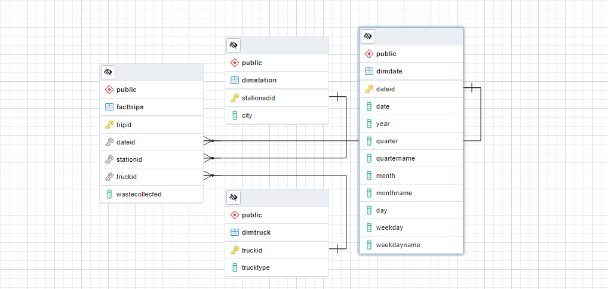
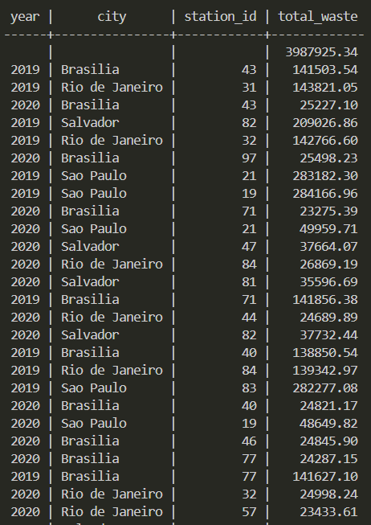
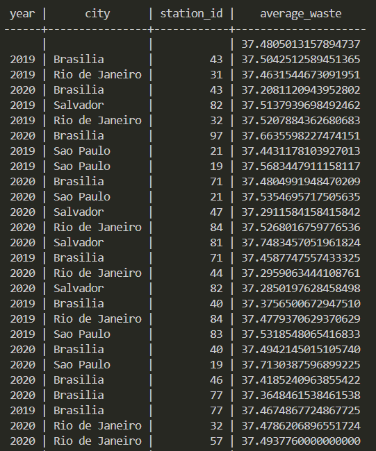
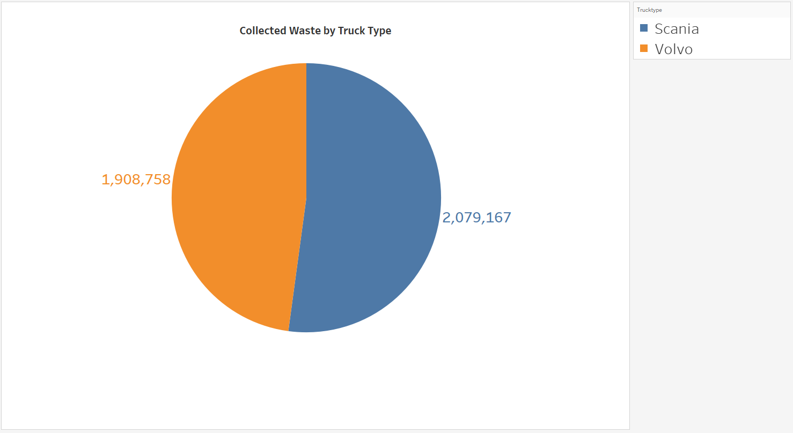
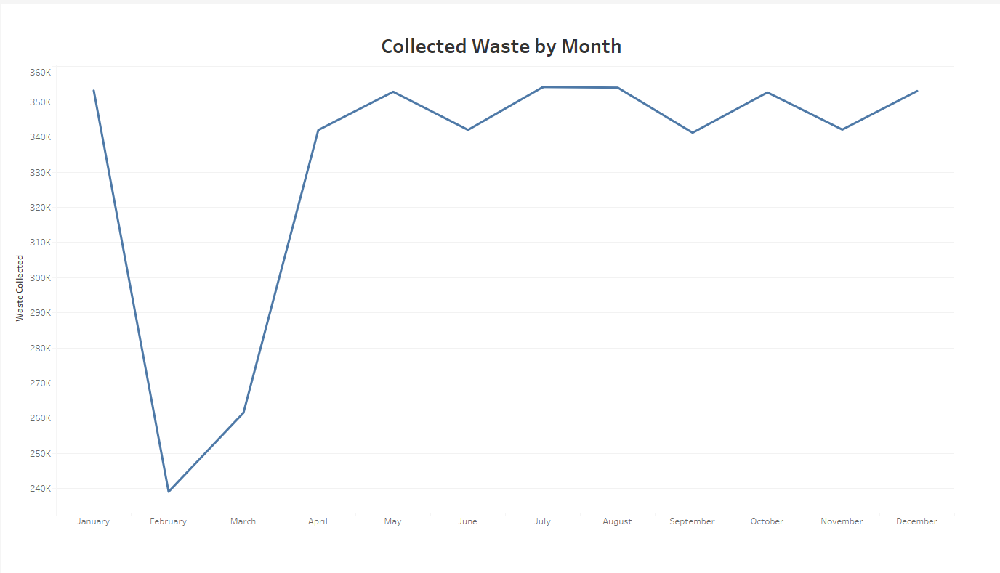
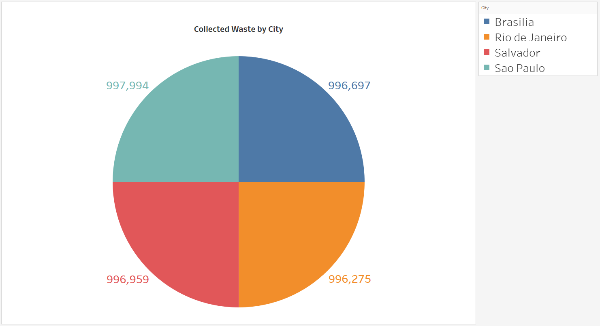

# Description

This is a small project where I designed a data warehouse using star schema to model the waste collection dataset. I then performed some aggregation queries to report some common metrics such as sum and average. Finally, the star schema was denormalized into one unified materialized view for dashboard reporting with Tableau. 

## Entity-Relationship Diagram (ERD)

## SQL Query

- [exercise_2.sql](exercise_2.sql): An initial failed attempt to model the business case. 
- [exercise_3.sql](exercise_3.sql): Create dimensional tables for date, truck, and station, and a fact table for waste collection trip. Load csv data into the tables.
- [exercise_4.sql](exercise_4.sql): Performed aggregated queries like CUBE and ROLLUP.
- [waste.sql](waste.sql): A dump file for rebuilding the database and its tables from the command line.
- [query.sql](query.sql): Create a materialized view of the denormalized schema and export it as a csv file.

## Aggregation Results

Here is a sneak peek to the analytics performance by the year in which waste collection occurs for each city and station.

### ROLLUP 

### CUBE

## Dashboard Results

After executing the queries and exporting the result dataset as a csv file, now we can move on to draw some visualizations for business finding. I used the Tableau professional edition for dashboarding. I connected Tableau to my local postgreSQL server, although one could directly load the csv file instead of connecting to the database.

Below are some notable results:

