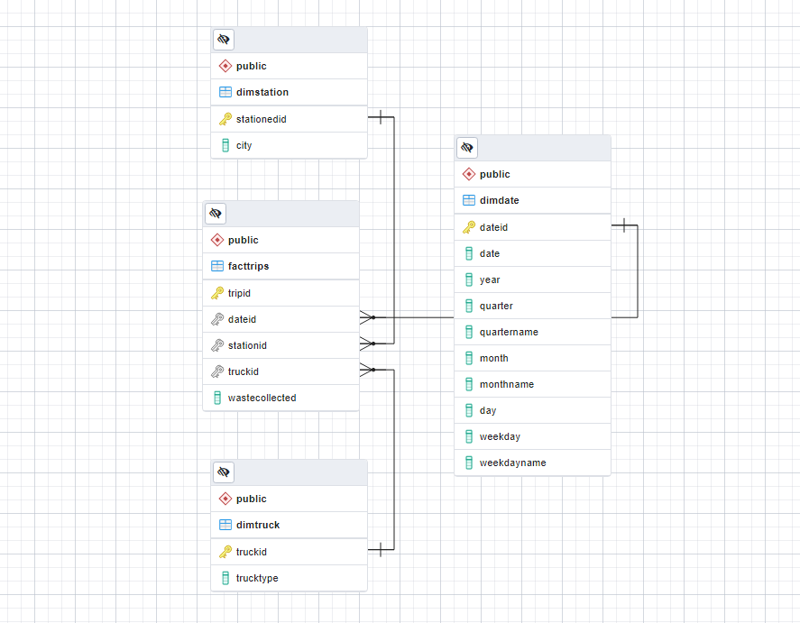

# Description

This is a small project where I designed a data warehouse using star schema to model the waste collection dataset. I then performed some aggregation queries to report some common metrics such as sum and average. Finally, the star schema was denormalized into one unified materialized view for dashboard reporting with Tableau. 

## Entity-Relationship Diagram (ERD)

## SQL Query

- ![exercise_2.sql]: an initial failed attempt to model the business case. 
- exercise_3.sql: create dimensional tables for date, truck, and station. Also create a fact table for waste collection trip. 
- exercise_4.sql: performed aggregated queries like CUBE and ROLLUP.
